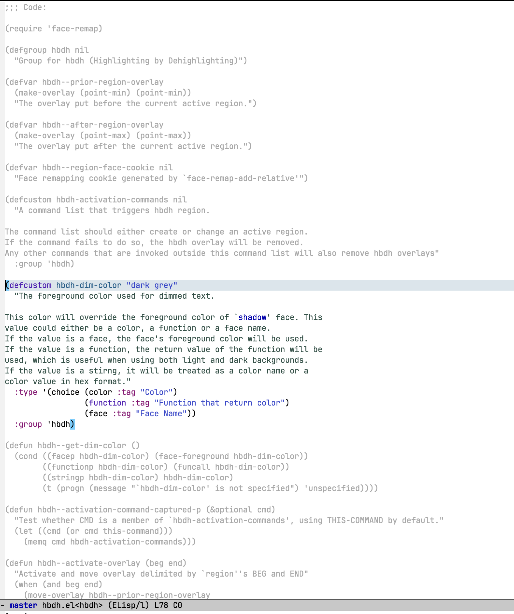

# HBDH mode

`hbdh-mode` is a global minor mode that highlight current active region by dimming text outside of it. `hbdh` is an abbreviation of "Highlighting By De-Highlighting".

# Screenshot



# Prerequisite

This package is tested on Emacs 29.1 and Emacs 30.

But the functions being used in the code doesn't exceed Emacs 23.1. So it may also work in Emacs later than this version.

# Installation & Setup

1. Clone this repo to a local directory

```bash
git clone https://github.com/zzhjerry/hbdh-mode.git ~/dev/hbdh-mode
```

2. Use `use-pacakge` to load this package

```emacs-lisp
(use-package hbdh-mode
  :load-path "~/dev/hbdh-mode"
  :config
  (setq hbdh-activation-commands '(mark-defun))
  (hbdh-mode))
```

# Usage

There are two ways to trigger this visual effect.

One way is to manually invoke `hbdh-activate-on-region` or type a keyboard shortcut `M-s a` when the current region is active.

Another option is to specify a value for `hbdh-activation-commands`, which is a list of commands that triggers `hbdh-activate-on-region` automatically. These commands should generate or change the range of a region. In this case, invoking any other commands that are not in the list will automatically invoke `hbdh-deactivate`

For example, if you use the following code in the configuration:

```emacs-lisp
(setq hbdh-activation-commands '(mark-defun))
```

When you call `mark-defun` (bound by `C-M-h`), the text outside of current highlighted function will be dimmed out (if you set `hbdh-dim-color` correctly)

# Customization

1. `hbdh-dim-color`

This is the foreground color that's used for dimmed texts. By default it's a color name called "dark gray".  You can invoke `list-color-display` to see available colors names.

If the value is a face name, the face's foreground color will be used. e.g.

If the value is a function, the return value of this function is used as the color.

2. `hbdh-activation-commands`

The value of this symbol should be a list of commands that generate or change a region.
